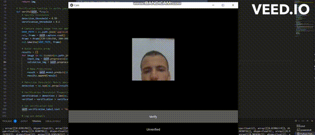

# Facial Detection Application using Deep Neural Network

Welcome to the **Facial Detection Application** readme! This application utilizes a deep neural network to perform facial detection in images and videos. With its advanced capabilities, it can identify and locate faces within provided media.

 The Facial Detection Application is an innovative solution powered by deep neural networks that enables accurate and efficient detection of human faces within images and videos. Leveraging the advancements in deep learning, this application plays a pivotal role in automating the process of identifying and localizing faces in various contexts.
